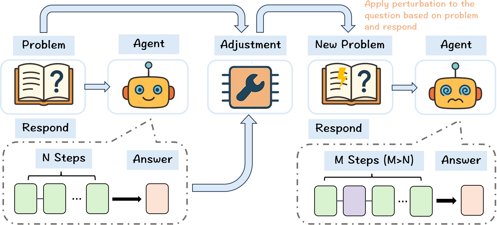
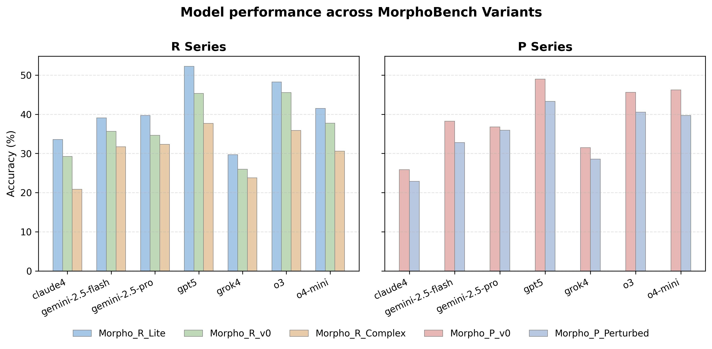

# 📣 Overview

## MorphoBench

[](https://arxiv.org/abs/2510.14265)
[](https://huggingface.co/datasets/OpenDCAI/MorphoBench)



MorphoBench is an adaptive reasoning benchmark for large-scale models. It curates over 1,300 multidisciplinary questions and dynamically adjusts task difficulty based on model reasoning traces, providing a scalable and reliable framework for evaluating the reasoning performance of advanced models like o3 and GPT-5.

# 🎓 Dataset

The MorphoBench dataset is available on Hugging Face: [OpenDCAI/MorphoBench](https://huggingface.co/datasets/OpenDCAI/MorphoBench)

```python
from datasets import load_dataset
dataset = load_dataset("OpenDCAI/MorphoBench")
```

After downloading, create a `data/` folder inside your local project directory and place the datasets there:

```
MorphoBench/
├── adaption/
├── asset/
├── data/
│   ├── Morpho_P_Perturbed/
│   ├── Morpho_P_v0/
│   ├── Morpho_R_Complex/
│   ├── Morpho_R_Lite/
│   └── Morpho_R_v0/
├── scripts/
├── output/
└── ...
```

# ⚙️ Usage

## Environment Setup

```bash
cd Morphobench
pip install -r requirements.txt
```

## Run Inference

Generate model predictions for all datasets:

```bash
bash scripts/run_batch.sh
```

Predictions will be saved under:

```
output/infer_result/
```

## Evaluate Model Results

Evaluate the reasoning performance:

```bash
bash scripts/evaluate_batch.sh
```

Evaluation metrics will be stored in:

```
output/eval_result/
```
# 📊 Evaluation Results

The following figure summarizes the evaluation results on MorphoBench



# 🙏 Acknowledgements

This project adapts evaluation script logic from [Humanity's Last Exam](https://github.com/centerforaisafety/hle).
